<!DOCTYPE html>
<html>
<body>

<h1>Projecte Gran Centre - Granollers</h1>

Pràctica en la que es demanava als alumnes que realitzesin una proposta d'app per l'eix comercial del Gran Centre de Granollers.
 

L'estructura de l'aplicació parteix d'un menú inicial amb sis butons que porten als diversos apartats d'aquesta. La intenció és realitzar aquests apartats emprant fragments i activities per mostrar informació diversa.
 
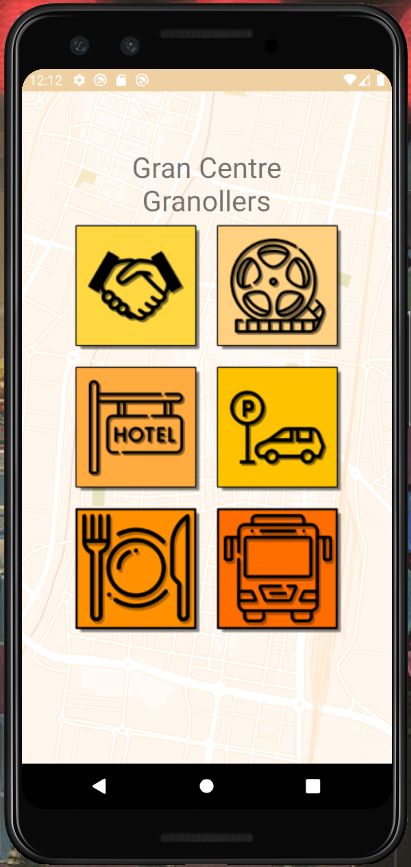 
<h2>Apartats de l'aplicació:</h2>
<ul>
  <li>Business</li>
  <li>Hotels</li>
  <li>Restaurants</li>
  <li>Cartellera</li>
  <li>Parkings</li>
  <li>Transports</li>
</ul> 

Els apartats corresponents a Business, Hotels i Restaurants són els de més complexitat, ja que requeixen de disposar de filtres per cercar tipologies de cormerços i restaurants i categories d'hotels.

<h2>Captures dels diferents apartats:</h2>
<h3>Business</h3>

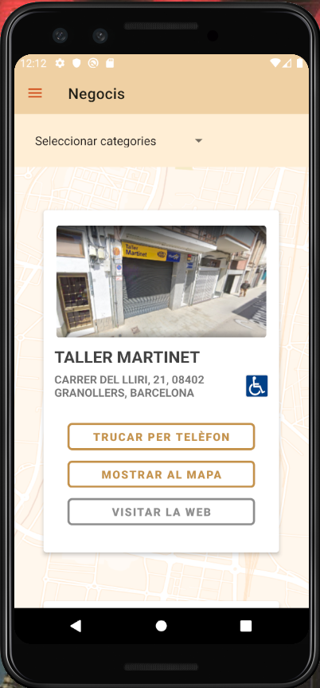
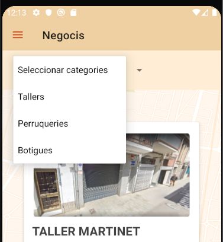
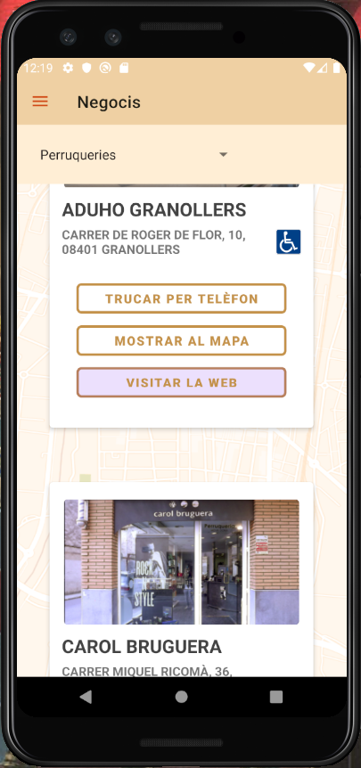
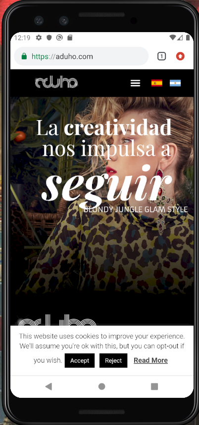

 
<h3>Hotels</h3>

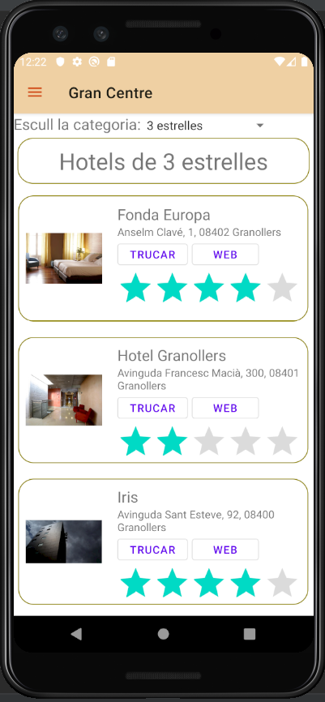
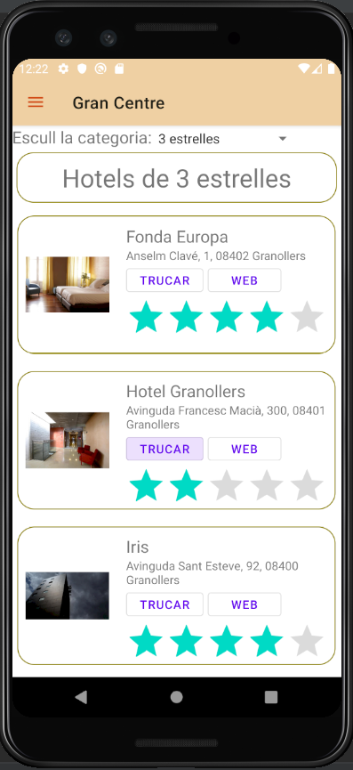
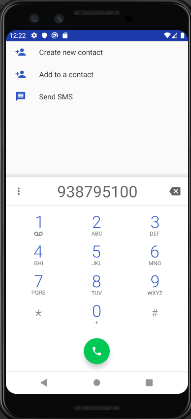

 
<h3>Restaurants</h3>

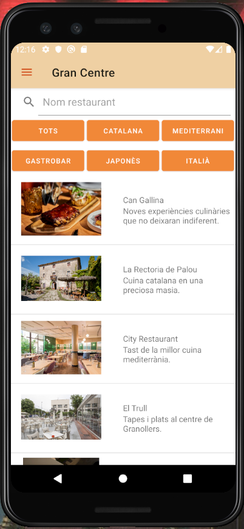
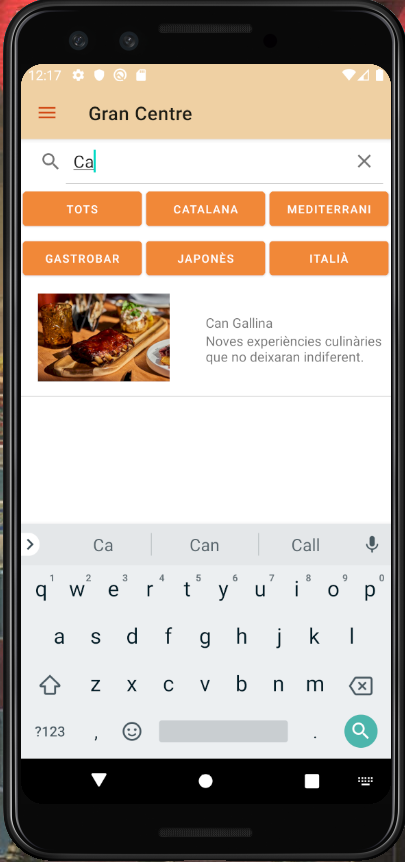
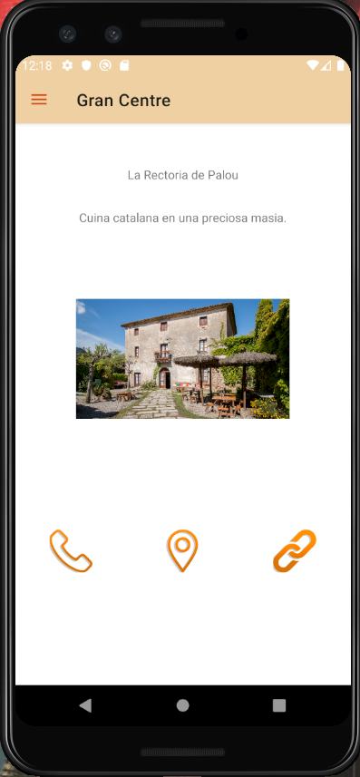

 
<h3>Cartellera</h3>

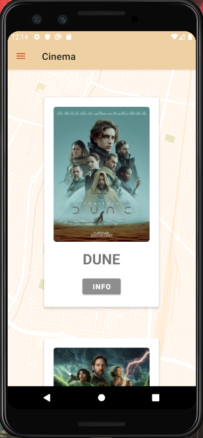

 
<h3>Parking</h3>

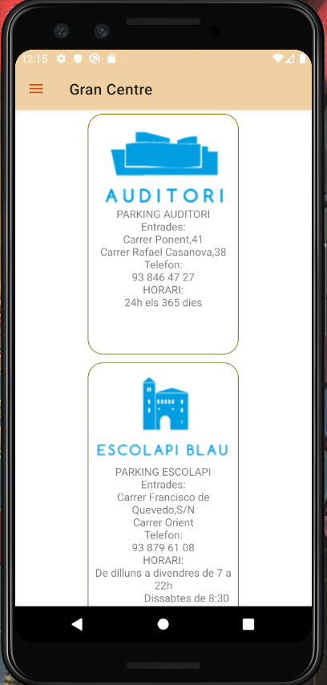

 
<h3>Transports</h3>

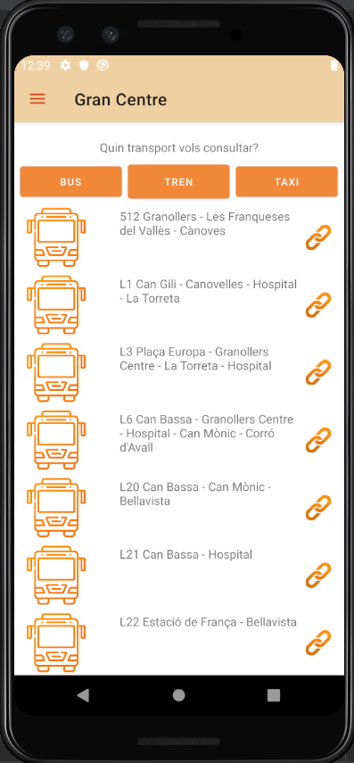
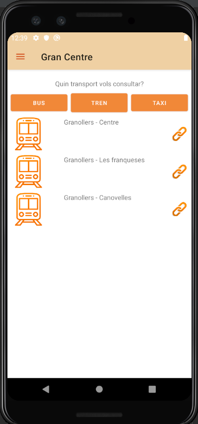
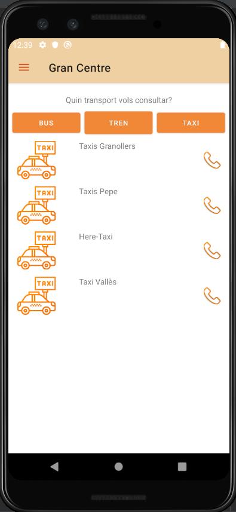

 

També es va obtar per fer un menú lateral per navegar de forma dinàmica entre els diferents apartats.

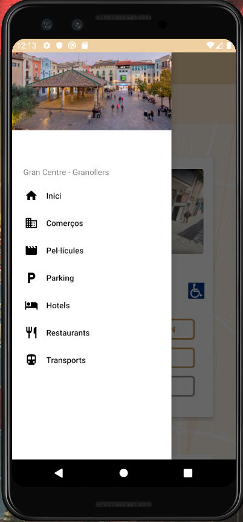

</body>
</html>
